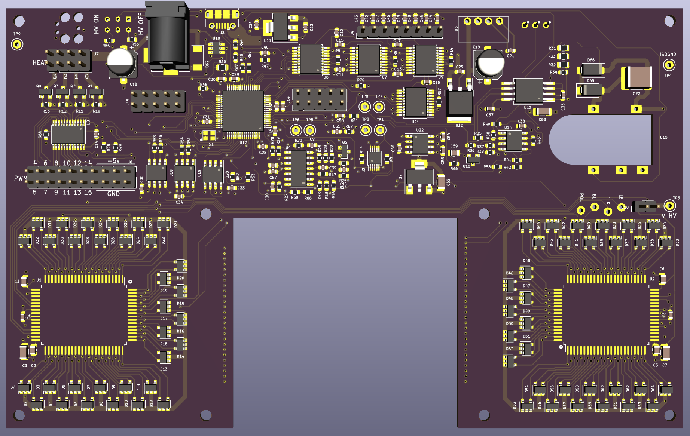

# PurpleDrop

Main printed circuit board design for PurpleDrop. 

The board design is done in KiCad v5.

Schematic print: [PurpleDrop_rev6_schematic.pdf](output/PurpleDrop_rev6_schematic.pdf)

Fab drawing: [PurpleDrop_rev6_fab.pfd](output/PurpleDrop_rev6_fab.pdf)

## BOM Generation

The [KiBom](https://github.com/SchrodingersGat/KiBoM) plugin is used to generate a BOM file, based on settings in `bom.ini`.
